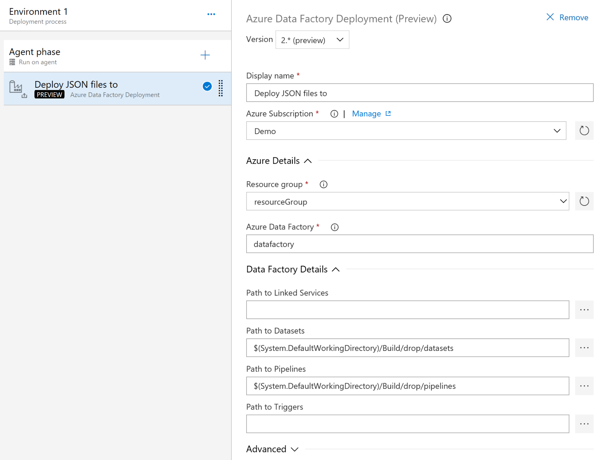
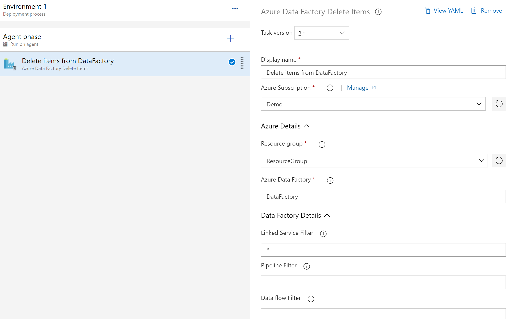
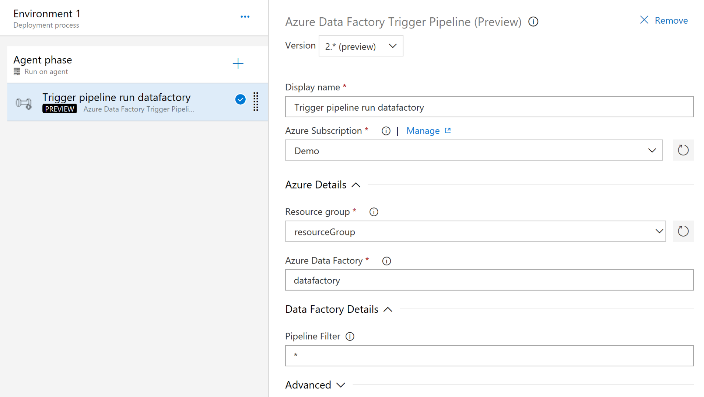
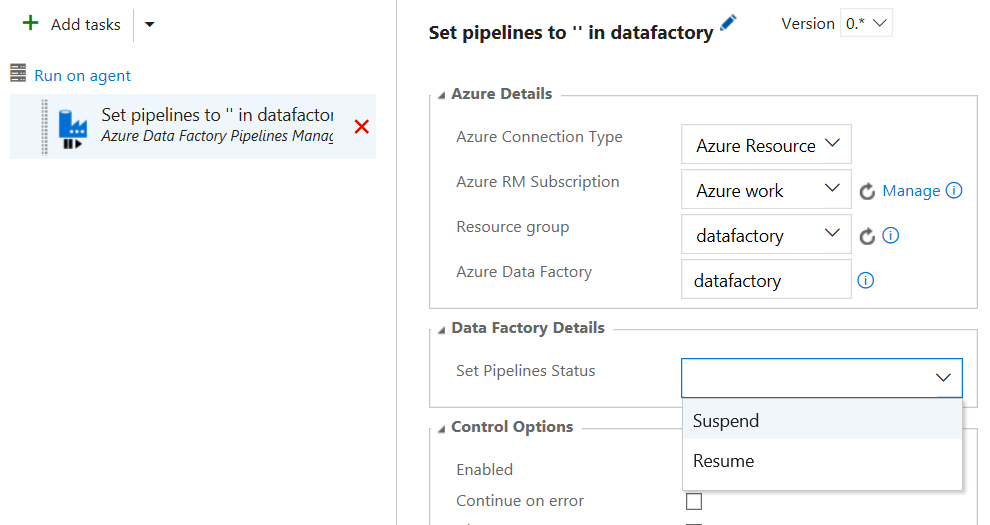

# Azure Data Factory

This extension adds release tasks related to Azure Data Factory (V1 and V2) to release pipelines of Azure DevOps.

## Azure Data Factory Deployment

Azure DevOps release task that will deploy JSON files with definition of Linked Services, Datasets, Pipelines and/or Triggers (V2) to an existing Azure Data Factory. 

[More information](deploy-adf-json/README.md)

## Azure Data Factory Trigger

Azure DevOps release task to either Start or Stop Azure Data Factory triggers.

[More information](toggle-adf-trigger/README.md)

## Azure Data Factory Delete Items

Azure DevOps release task to delete Azure Data Factory items, like triggers, pipelines, datasets and linked services.

[More information](delete-adf-items/README.md)

## Azure Data Factory Trigger Pipelines

Azure DevOps release task to trigger an Azure Data Factory pipeline to start.

[More information](trigger-adf-pipeline/README.md)

## Azure Data Factory Pipelines Management

Azure DevOps release task to either suspend or resume all pipelines of an Azure Data Factory.

[More information](suspend-adf-pipeline/README.md)

## Release notes

**2.0.0**  **PREVIEW**
- Added new task: Delete Items
- Added new task: Toggle Pipeline
- Rewrite to platform independent version by using NodeJS and REST APIs
- This version only support Azure Data Factory v2
- Readme updated to version 2 functionality

**1.5.7**
- Added support for V2 deployments
- Added trigger start/stop task (V2)

**1.0.7**
- Add extra error logging

**1.0.5**
- [Bug] Fixed suspend/resume logic

**1.0.0**
- Initial public release