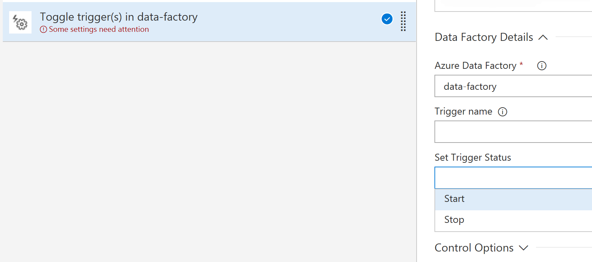

# Azure Data Factory Trigger

This release task can be added to a release pipeline to either start or stop Azure Data Factory triggers.

## Parameters

Generic:

- **Display name** - Description name of the task
- **Azure Subscription** - Which Azure Subscription (Service Endpoint) should be used to connect to the datafactory

Azure Details:
- **Resource Group** - To which Resource Group is the Azure Data Factory deployed
- **Azure Data Factory** - The name of the Azure Data Factory.

Data Factory Details:
- **Trigger Filter** - Filter to determine which triggers to delete.
    - Empty string: *none* items will be deleted.
    - `*`: *all* found items will be deleted.
- **Set Trigger Status** - The status of the stigger: Start or Stop.

## Release notes

**2.0.0** **PREVIEW**

- Rewrite to platform independent version by using NodeJS and REST APIs
- This version only support Azure Data Factory v2
- Readme updated to version 2 functionality

**1.0.4**
- Initial public release